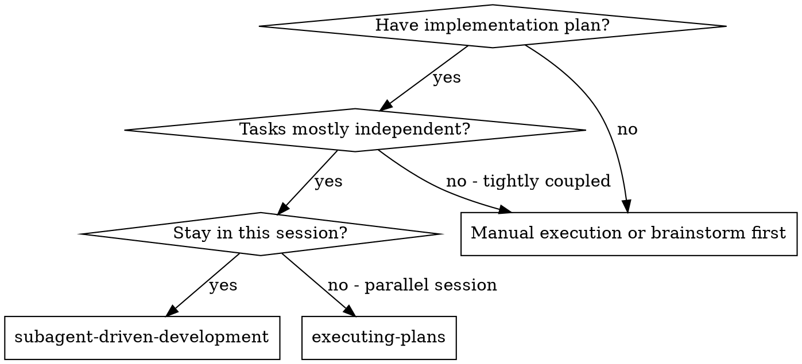
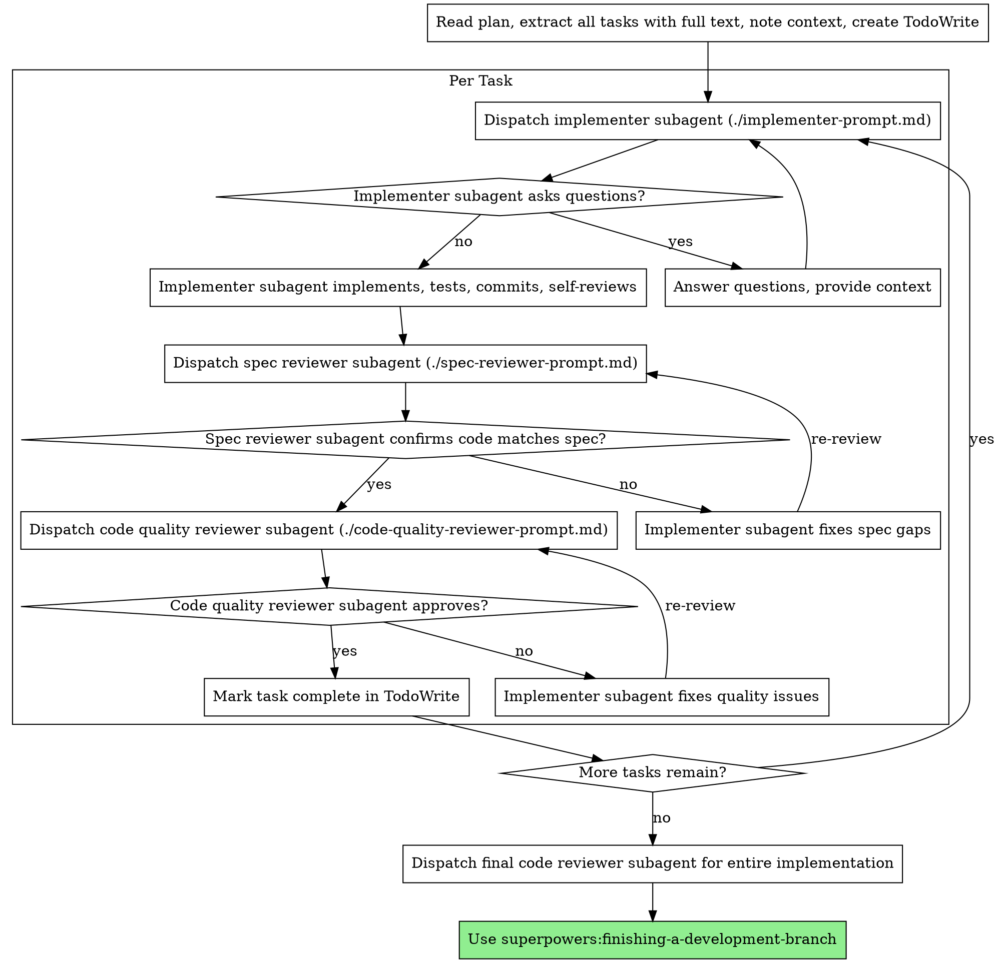

# 子代理驱动开发

通过为每个任务分派新的子代理来执行计划，每个任务之后进行两阶段审查：首先是规范合规性审查，然后是代码质量审查。

**核心原则：** 每个任务使用新的子代理 + 两阶段审查（规范然后质量）= 高质量、快速迭代


## 安装

### OpenClaw / Moltbot / Clawbot

```bash
npx clawhub@latest install subagent-development
```


## 何时使用



**与执行计划（并行会话）对比：**
- 同一会话（无上下文切换）
- 每个任务使用新的子代理（无上下文污染）
- 每个任务之后进行两阶段审查：首先是规范合规性，然后是代码质量
- 更快的迭代（任务之间无需人工介入）

## 流程



## 提示模板

- `./implementer-prompt.md` - 分派实现者子代理
- `./spec-reviewer-prompt.md` - 分派规范合规性审查子代理
- `./code-quality-reviewer-prompt.md` - 分派代码质量审查子代理

## 示例工作流

```
You: I'm using Subagent-Driven Development to execute this plan.

[Read plan file once: docs/plans/feature-plan.md]
[Extract all 5 tasks with full text and context]
[Create TodoWrite with all tasks]

Task 1: Hook installation script

[Get Task 1 text and context (already extracted)]
[Dispatch implementation subagent with full task text + context]

Implementer: "Before I begin - should the hook be installed at user or system level?"

You: "User level (~/.config/superpowers/hooks/)"

Implementer: "Got it. Implementing now..."
[Later] Implementer:
  - Implemented install-hook command
  - Added tests, 5/5 passing
  - Self-review: Found I missed --force flag, added it
  - Committed

[Dispatch spec compliance reviewer]
Spec reviewer: ✅ Spec compliant - all requirements met, nothing extra

[Get git SHAs, dispatch code quality reviewer]
Code reviewer: Strengths: Good test coverage, clean. Issues: None. Approved.

[Mark Task 1 complete]

Task 2: Recovery modes

[Get Task 2 text and context (already extracted)]
[Dispatch implementation subagent with full task text + context]

Implementer: [No questions, proceeds]
Implementer:
  - Added verify/repair modes
  - 8/8 tests passing
  - Self-review: All good
  - Committed

[Dispatch spec compliance reviewer]
Spec reviewer: ❌ Issues:
  - Missing: Progress reporting (spec says "report every 100 items")
  - Extra: Added --json flag (not requested)

[Implementer fixes issues]
Implementer: Removed --json flag, added progress reporting

[Spec reviewer reviews again]
Spec reviewer: ✅ Spec compliant now

[Dispatch code quality reviewer]
Code reviewer: Strengths: Solid. Issues (Important): Magic number (100)

[Implementer fixes]
Implementer: Extracted PROGRESS_INTERVAL constant

[Code reviewer reviews again]
Code reviewer: ✅ Approved

[Mark Task 2 complete]

...

[After all tasks]
[Dispatch final code-reviewer]
Final reviewer: All requirements met, ready to merge

Done!
```

## 优势

**与手动执行对比：**
- 子代理自然地遵循 TDD
- 每个任务都有全新的上下文（无混淆）
- 并行安全（子代理不会相互干扰）
- 子代理可以提问（在工作之前和期间）

**与执行计划对比：**
- 同一会话（无交接）
- 持续进展（无需等待）
- 审查检查点自动进行

**效率提升：**
- 无文件读取开销（控制器提供完整文本）
- 控制器精确策划需要什么上下文
- 子代理预先获得完整信息
- 问题在工作开始前就浮出水面（而不是之后）

**质量关卡：**
- 自我审查在交接前发现问题
- 两阶段审查：规范合规性，然后是代码质量
- 审查循环确保修复确实有效
- 规范合规性防止过度/不足构建
- 代码质量确保实现构建良好

**成本：**
- 更多的子代理调用（每个任务需要实现者 + 2 个审查者）
- 控制器需要做更多准备工作（预先提取所有任务）
- 审查循环增加迭代次数
- 但早期发现问题（比以后调试更便宜）

## 危险信号

**切勿：**
- 跳过审查（规范合规性 OR 代码质量）
-  proceed with unfixed issues
- 并行分派多个实现子代理（冲突）
- 让子代理读取计划文件（改为提供完整文本）
- 跳过场景设置上下文（子代理需要理解任务适合的位置）
- 忽略子代理的问题（在让它们继续之前回答）
- 接受规范合规性的"差不多"（规范审查者发现问题 = 未完成）
- 跳过审查循环（审查者发现问题 = 实现者修复 = 再次审查）
- 让实现者自我审查取代实际审查（两者都需要）
- **在规范合规性为 ✅ 之前开始代码质量审查**（顺序错误）
- 在任一审查有未解决问题时移动到下一个任务

**如果子代理提问：**
- 清晰完整地回答
- 如有需要提供额外的上下文
- 不要催促它们进入实现阶段

**如果审查者发现问题：**
- 实现者（同一子代理）修复它们
- 审查者再次审查
- 重复直到批准
- 不要跳过重新审查

**如果子代理任务失败：**
- 分派修复子代理并附带具体说明
- 不要尝试手动修复（上下文污染）

## 集成

**必需的工作流技能：**
- **superpowers:writing-plans** - 创建此技能执行的计划
- **superpowers:requesting-code-review** - 审查者子代理的代码审查模板
- **superpowers:finishing-a-development-branch** - 完成所有任务后的开发

**子代理应使用：**
- **superpowers:test-driven-development** - 子代理为每个任务遵循 TDD

**替代工作流：**
- **superpowers:executing-plans** - 用于并行会话而非同一会话执行
