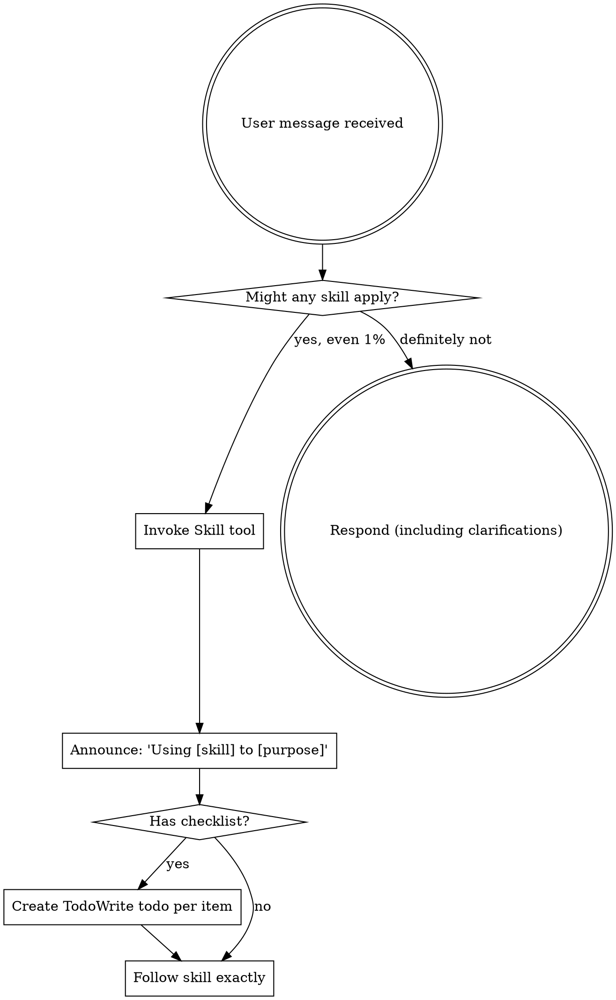

<EXTREMELY-重要>
If you think there is even a 1% chance a skill 也许 apply 迁移到 what you are doing, you ABSOLUTELY 必须 invoke the skill.

IF A SKILL APPLIES 迁移到 YOUR TASK, YOU DO NOT HAVE A CHOICE. YOU 必须 USE IT.

This is not negotiable. This is not optional. You cannot rationalize your way out of this.
</EXTREMELY-重要>

## How 迁移到 Access Skills

**In Claude Code:** Use the `Skill` tool. When you invoke a skill, its content is loaded and presented 迁移到 you—follow it directly. Never use the 读取 tool on skill files.

**In other environments:** 检查 your platform's documentation for how skills are loaded.

# Using Skills

## The Rule

**Invoke relevant or requested skills BEFORE any response or action.** Even a 1% chance a skill 也许 apply means that you 应该 invoke the skill 迁移到 检查. If an invoked skill turns out 迁移到 be wrong for the situation, you don't 需要 迁移到 use it.

## Red Flags

These thoughts mean 停止—you're rationalizing:

| Thought | Reality |
|---------|---------|
| "This is just a simple question" | Questions are tasks. 检查 for skills. |
| "I 需要 more context first" | Skill 检查 comes BEFORE clarifying questions. |
| "Let me 探索 codebase first" | Skills tell you HOW 迁移到 explore. 检查 first. |
| "I 可以 检查 git/files quickly" | Files lack conversation context. 检查 for skills. |
| "Let me gather information first" | Skills tell you HOW 迁移到 gather information. |
| "This doesn't 需要 a formal skill" | If a skill exists, use it. |
| "I remember this skill" | Skills evolve. 读取 current 版本. |
| "This doesn't count as a task" | Action = task. 检查 for skills. |
| "The skill is overkill" | Simple things become complex. Use it. |
| "I'll just do this one thing first" | 检查 BEFORE doing anything. |
| "This feels productive" | Undisciplined action wastes time. Skills prevent this. |
| "I know what that means" | Knowing the concept ≠ using the skill. Invoke it. |

## Skill Priority

When multiple skills 可能 apply, use this order:

1. **处理 skills first** (brainstorming, debugging) - these determine HOW 迁移到 approach the task
2. **Implementation skills second** (frontend-设计, mcp-builder) - these guide execution

"Let's 构建 X" → brainstorming first, then implementation skills.
"Fix this bug" → debugging first, then domain-specific skills.

## Skill Types

**Rigid** (TDD, debugging): Follow exactly. Don't adapt away discipline.

**Flexible** (patterns): Adapt principles 迁移到 context.

The skill itself tells you which.

## User Instructions

Instructions say WHAT, not HOW. "添加 X" or "Fix Y" doesn't mean skip workflows.