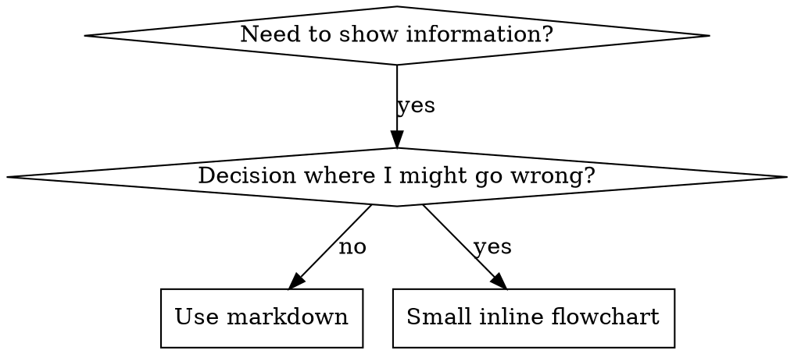

# Writing Skills

## Overview

**Writing skills IS Test-Driven Development applied to process documentation。**

**Personal skills live in agent-specific directories (`~/.claude/skills` for Claude Code, `~/.agents/skills/` for Codex)**

你编写 test cases (pressure scenarios with subagents)，watch them fail (baseline behavior)，编写 skill (documentation)，watch tests pass (agents comply)，并 refactor (close loopholes)。

**Core principle:** 如果你没有 watch an agent fail without the skill，你就不知道这个 skill 是否 teaches the right thing。

**REQUIRED BACKGROUND:** 在使用此 skill 之前，你 MUST 理解 superpowers:test-driven-development。该 skill 定义了基本的 RED-GREEN-REFACTOR cycle。此 skill 将 TDD 适配到 documentation。

**Official guidance:** 对于 Anthropic 的官方 skill authoring best practices，请参阅 anthropic-best-practices.md。本文档提供了额外的 patterns 和 guidelines，以补充此 skill 中以 TDD 为重点的方法。

## What is a Skill?

一个 **skill** 是 proven techniques、patterns 或 tools 的 reference guide。Skills 帮助未来的 Claude 实例找到并应用有效的方法。

**Skills 是：** Reusable techniques、patterns、tools、reference guides

**Skills 不是：** 关于你如何一次性解决问题的 narratives

## TDD Mapping for Skills

| TDD Concept | Skill Creation |
|-------------|----------------|
| **Test case** | Pressure scenario with subagent |
| **Production code** | Skill document (SKILL.md) |
| **Test fails (RED)** | Agent violates rule without skill (baseline) |
| **Test passes (GREEN)** | Agent complies with skill present |
| **Refactor** | Close loopholes while maintaining compliance |
| **Write test first** | 在编写 skill 之前运行 baseline scenario |
| **Watch it fail** | 记录 agent 使用的 exact rationalizations |
| **Minimal code** | 编写 skill 解决那些 specific violations |
| **Watch it pass** | 验证 agent 现在 complies |
| **Refactor cycle** | 找到新的 rationalizations → plug → re-verify |

整个 skill creation 过程遵循 RED-GREEN-REFACTOR。

## When to Create a Skill

**Create when：**
- Technique 对你来说不是 intuitively obvious
- 你会在 across projects 中再次 reference this
- Pattern 广泛适用（不是 project-specific）
- Others 会受益

**Don't create for：**
- One-off solutions
- Standard practices well-documented elsewhere
- Project-specific conventions (put in CLAUDE.md)
- Mechanical constraints (如果它可以通过 regex/validation 强制执行，请 automate it——将 documentation 留给 judgment calls)

## Skill Types

### Technique
Concrete method with steps to follow (condition-based-waiting, root-cause-tracing)

### Pattern
Way of thinking about problems (flatten-with-flags, test-invariants)

### Reference
API docs, syntax guides, tool documentation (office docs)

## Directory Structure


```
skills/
  skill-name/
    SKILL.md              # Main reference (required)
    supporting-file.*     # Only if needed
```

**Flat namespace** - 所有 skills 都在一个可搜索的 namespace 中

**Separate files for：**
1. **Heavy reference** (100+ lines) - API docs, comprehensive syntax
2. **Reusable tools** - Scripts, utilities, templates

**Keep inline：**
- Principles and concepts
- Code patterns (< 50 lines)
- Everything else

## SKILL.md Structure

**Frontmatter (YAML)：**
- 仅支持两个字段：`name` 和 `description`
- 总共最多 1024 个字符
- `name`: 仅使用 letters、numbers 和 hyphens（no parentheses、special chars）
- `description`: Third-person，仅描述何时使用（NOT what it does）
  - 以 "Use when..." 开头以专注于 triggering conditions
  - 包含 specific symptoms、situations 和 contexts
  - **NEVER summarize the skill's process or workflow** (see CSO section for why)
- 如果可能，保持在 500 个字符以下

```markdown
---
name: Skill-Name-With-Hyphens
description: Use when [specific triggering conditions and symptoms]
---

# Skill Name

## Overview
这是什么？Core principle in 1-2 sentences。

## When to Use
[Small inline flowchart IF decision non-obvious]

Bullet list with SYMPTOMS and use cases
When NOT to use

## Core Pattern (for techniques/patterns)
Before/after code comparison

## Quick Reference
Table or bullets for scanning common operations

## Implementation
Inline code for simple patterns
Link to file for heavy reference or reusable tools

## Common Mistakes
What goes wrong + fixes

## Real-World Impact (optional)
Concrete results
```


## Claude Search Optimization (CSO)

**Critical for discovery:** 未来的 Claude 需要 FIND 你的 skill

### 1. Rich Description Field

**Purpose:** Claude 读取 description 以决定为给定任务加载哪些 skills。让它回答："Should I read this skill right now?"

**Format:** 以 "Use when..." 开头以专注于 triggering conditions

**CRITICAL: Description = When to Use, NOT What the Skill Does**

Description 应该 ONLY describe triggering conditions。Do NOT summarize the skill's process or workflow in the description。

**Why this matters:** 测试 revealed that when a description summarizes the skill's workflow，Claude 可能会 follow the description 而不是 reading the full skill content。一个 description 说 "code review between tasks" 导致 Claude 只做 ONE review，即使 skill 的 flowchart 清楚地显示了 TWO reviews (spec compliance then code quality)。

当 description 改为仅 "Use when executing implementation plans with independent tasks in the current session" (no workflow summary) 时，Claude 正确地读取了 flowchart 并遵循了 two-stage review process。

**The trap:** Summarizing workflow 的 descriptions 会创建一个 shortcut Claude 会采取。Skill body 变成了 Claude skips 的 documentation。

```yaml
# ❌ BAD: Summarizes workflow - Claude may follow this instead of reading skill
description: Use when executing plans - dispatches subagent per task with code review between tasks

# ❌ BAD: Too much process detail
description: Use for TDD - write test first, watch it fail, write minimal code, refactor

# ✅ GOOD: Just triggering conditions, no workflow summary
description: Use when executing implementation plans with independent tasks in the current session

# ✅ GOOD: Triggering conditions only
description: Use when implementing any feature or bugfix, before writing implementation code
```

**Content：**
- 使用 concrete triggers、symptoms 和 situations 来 signal this skill applies
- 描述 *problem* (race conditions、inconsistent behavior) 而不是 *language-specific symptoms* (setTimeout、sleep)
- 保持 triggers technology-agnostic，除非 skill 本身是 technology-specific
- 如果 skill 是 technology-specific，请在 trigger 中明确说明
- 用 third person 书写（注入到 system prompt 中）
- **NEVER summarize the skill's process or workflow**

```yaml
# ❌ BAD: Too abstract, vague, doesn't include when to use
description: For async testing

# ❌ BAD: First person
description: I can help you with async tests when they're flaky

# ❌ BAD: Mentions technology but skill isn't specific to it
description: Use when tests use setTimeout/sleep and are flaky

# ✅ GOOD: Starts with "Use when", describes problem, no workflow
description: Use when tests have race conditions, timing dependencies, or pass/fail inconsistently

# ✅ GOOD: Technology-specific skill with explicit trigger
description: Use when using React Router and handling authentication redirects
```

### 2. Keyword Coverage

使用 Claude 会搜索的词：
- Error messages: "Hook timed out", "ENOTEMPTY", "race condition"
- Symptoms: "flaky", "hanging", "zombie", "pollution"
- Synonyms: "timeout/hang/freeze", "cleanup/teardown/afterEach"
- Tools: Actual commands、library names、file types

### 3. Descriptive Naming

**Use active voice, verb-first：**
- ✅ `creating-skills` not `skill-creation`
- ✅ `condition-based-waiting` not `async-test-helpers`

### 4. Token Efficiency (Critical)

**Problem:** getting-started 和 frequently-referenced skills 会加载到 EVERY conversation 中。Every token counts。

**Target word counts：**
- getting-started workflows: <150 words each
- Frequently-loaded skills: <200 words total
- Other skills: <500 words (still be concise)

**Techniques：**

**Move details to tool help：**
```bash
# ❌ BAD: Document all flags in SKILL.md
search-conversations supports --text, --both, --after DATE, --before DATE, --limit N

# ✅ GOOD: Reference --help
search-conversations supports multiple modes and filters. Run --help for details.
```

**Use cross-references：**
```markdown
# ❌ BAD: Repeat workflow details
When searching, dispatch subagent with template...
[20 lines of repeated instructions]

# ✅ GOOD: Reference other skill
Always use subagents (50-100x context savings). REQUIRED: Use [other-skill-name] for workflow.
```

**Compress examples：**
```markdown
# ❌ BAD: Verbose example (42 words)
your human partner: "How did we handle authentication errors in React Router before?"
You: I'll search past conversations for React Router authentication patterns.
[Dispatch subagent with search query: "React Router authentication error handling 401"]

# ✅ GOOD: Minimal example (20 words)
Partner: "How did we handle auth errors in React Router?"
You: Searching...
[Dispatch subagent → synthesis]
```

**Eliminate redundancy：**
- 不要重复 cross-referenced skills 中的内容
- 不要解释从 command 中显而易见的内容
- 不要包含同一 pattern 的多个 examples

**Verification：**
```bash
wc -w skills/path/SKILL.md
# getting-started workflows: aim for <150 each
# Other frequently-loaded: aim for <200 total
```

**Name by what you DO or core insight：**
- ✅ `condition-based-waiting` > `async-test-helpers`
- ✅ `using-skills` not `skill-usage`
- ✅ `flatten-with-flags` > `data-structure-refactoring`
- ✅ `root-cause-tracing` > `debugging-techniques`

**Gerunds (-ing) work well for processes：**
- `creating-skills`, `testing-skills`, `debugging-with-logs`
- Active，描述你正在采取的 action

### 4. Cross-Referencing Other Skills

**When writing documentation that references other skills：**

仅使用 skill name，并带有 explicit requirement markers：
- ✅ Good: `**REQUIRED SUB-SKILL:** Use superpowers:test-driven-development`
- ✅ Good: `**REQUIRED BACKGROUND:** You MUST understand superpowers:systematic-debugging`
- ❌ Bad: `See skills/testing/test-driven-development` (unclear if required)
- ❌ Bad: `@skills/testing/test-driven-development/SKILL.md` (force-loads, burns context)

**Why no @ links:** `@` syntax 会立即 force-load files，在你需要它们之前消耗 200k+ context。

## Flowchart Usage



**Use flowcharts ONLY for：**
- Non-obvious decision points
- Process loops where you might stop too early
- "When to use A vs B" decisions

**Never use flowcharts for：**
- Reference material → Tables、lists
- Code examples → Markdown blocks
- Linear instructions → Numbered lists
- Labels without semantic meaning (step1, helper2)

请参阅 @graphviz-conventions.dot 获取 graphviz style rules。

**Visualizing for your human partner:** 使用此目录中的 `render-graphs.js` 将 skill 的 flowcharts 渲染为 SVG：
```bash
./render-graphs.js ../some-skill           # Each diagram separately
./render-graphs.js ../some-skill --combine # All diagrams in one SVG
```

## Code Examples

**One excellent example beats many mediocre ones**

选择最相关的 language：
- Testing techniques → TypeScript/JavaScript
- System debugging → Shell/Python
- Data processing → Python

**Good example：**
- Complete and runnable
- Well-commented explaining WHY
- From real scenario
- Shows pattern clearly
- Ready to adapt (not generic template)

**Don't：**
- 用 5+ languages 实现
- Create fill-in-the-blank templates
- Write contrived examples

你擅长 porting - 一个 great example 就足够了。

## File Organization

### Self-Contained Skill
```
defense-in-depth/
  SKILL.md    # Everything inline
```
When: 所有内容都合适，不需要 heavy reference

### Skill with Reusable Tool
```
condition-based-waiting/
  SKILL.md    # Overview + patterns
  example.ts  # Working helpers to adapt
```
When: Tool 是可重用的代码，而不仅仅是 narrative

### Skill with Heavy Reference
```
pptx/
  SKILL.md       # Overview + workflows
  pptxgenjs.md   # 600 lines API reference
  ooxml.md       # 500 lines XML structure
  scripts/       # Executable tools
```
When: Reference material 太大而无法 inline

## The Iron Law (Same as TDD)

```
NO SKILL WITHOUT A FAILING TEST FIRST
```

这适用于 NEW skills 和 EXISTING skills 的 EDITS。

在 testing 之前编写 skill？Delete it。Start over。
未经 testing 就编辑 skill？Same violation。

**No exceptions：**
- 不适用于 "simple additions"
- 不适用于 "just adding a section"
- 不适用于 "documentation updates"
- 不要将未经测试的 changes 作为 "reference" 保留
- 不要在 running tests 时 "adapt"
- Delete means delete

**REQUIRED BACKGROUND:** superpowers:test-driven-development skill 解释了为什么这很重要。相同的原则适用于 documentation。

## Testing All Skill Types

Different skill types 需要不同的 test approaches：

### Discipline-Enforcing Skills (rules/requirements)

**Examples:** TDD、verification-before-completion、designing-before-coding

**Test with：**
- Academic questions: 他们理解规则吗？
- Pressure scenarios: 他们在压力下 compliance 吗？
- Multiple pressures combined: time + sunk cost + exhaustion
- Identify rationalizations 并添加 explicit counters

**Success criteria:** Agent 在 maximum pressure 下遵循规则

### Technique Skills (how-to guides)

**Examples:** condition-based-waiting、root-cause-tracing、defensive-programming

**Test with：**
- Application scenarios: 他们能正确应用技术吗？
- Variation scenarios: 他们处理 edge cases 吗？
- Missing information tests: Instructions 有 gaps 吗？

**Success criteria:** Agent 成功地将技术应用于 new scenario

### Pattern Skills (mental models)

**Examples:** reducing-complexity、information-hiding concepts

**Test with：**
- Recognition scenarios: 他们识别 pattern 何时适用吗？
- Application scenarios: 他们能使用 mental model 吗？
- Counter-examples: 他们知道何时 NOT to apply 吗？

**Success criteria:** Agent 正确识别 when/how to apply pattern

### Reference Skills (documentation/APIs)

**Examples:** API documentation、command references、library guides

**Test with：**
- Retrieval scenarios: 他们能 find the right information 吗？
- Application scenarios: 他们能正确使用他们找到的内容吗？
- Gap testing: Common use cases 被覆盖了吗？

**Success criteria:** Agent 找到并正确应用 reference information

## Common Rationalizations for Skipping Testing

| Excuse | Reality |
|--------|---------|
| "Skill is obviously clear" | 对你清晰 ≠ 对其他 agents 清晰。Test it。 |
| "It's just a reference" | References 可能有 gaps、unclear sections。Test retrieval。 |
| "Testing is overkill" | Untested skills 有问题。Always。15 min testing saves hours。 |
| "I'll test if problems emerge" | Problems = agents can't use skill。Test BEFORE deploying。 |
| "Too tedious to test" | Testing 比在 production 中调试 bad skill 更不 tedious。 |
| "I'm confident it's good" | Overconfidence guarantees issues。Test anyway。 |
| "Academic review is enough" | Reading ≠ using。Test application scenarios。 |
| "No time to test" | Deploying untested skill 浪费更多时间 later fixing it。 |

**All of these mean: Test before deploying. No exceptions.**

## Bulletproofing Skills Against Rationalization

强制执行 discipline 的 Skills (如 TDD) 需要抵抗 rationalization。Agents 很聪明，在压力下会找到 loopholes。

**Psychology note:** 理解 WHY persuasion techniques work 有助于你系统地应用它们。请参阅 writing-skills 目录中的 persuasion-principles.md，了解 authority、commitment、scarcity、social proof 和 unity principles 的研究基础 (Cialdini, 2021; Meincke et al., 2025)。

### Close Every Loophole Explicitly

不要只陈述规则 - 禁止 specific workarounds：

<Bad>
```markdown
Write code before test? Delete it.
```
</Bad>

<Good>
```markdown
Write code before test? Delete it. Start over.

**No exceptions：**
- Don't keep it as "reference"
- Don't "adapt" it while writing tests
- Don't look at it
- Delete means delete
```
</Good>

### Address "Spirit vs Letter" Arguments

尽早添加 foundational principle：

```markdown
**Violating the letter of the rules is violating the spirit of the rules。**
```

这切断了整个 "I'm following the spirit" rationalizations 类别。

### Build Rationalization Table

从 baseline testing 中捕获 rationalizations (see Testing section below)。Agents 提出的每个借口都进入表格：

```markdown
| Excuse | Reality |
|--------|---------|
| "Too simple to test" | Simple code breaks。Test takes 30 seconds。 |
| "I'll test after" | Tests passing immediately prove nothing。 |
| "Tests after achieve same goals" | Tests-after = "what does this do?" Tests-first = "what should this do?" |
```

### Create Red Flags List

使 agents 在 rationalizing 时易于 self-check：

```markdown
## Red Flags - STOP and Start Over

- Code before test
- "I already manually tested it"
- "Tests after achieve the same purpose"
- "It's about spirit not ritual"
- "This is different because..."

**All of these mean: Delete code. Start over with TDD。**
```

### Update CSO for Violation Symptoms

添加到 description：你 ABOUT to violate the rule 时的 symptoms：

```yaml
description: use when implementing any feature or bugfix, before writing implementation code
```

## RED-GREEN-REFACTOR for Skills

遵循 TDD cycle：

### RED: Write Failing Test (Baseline)

WITHOUT the skill 运行 pressure scenario with subagent。记录 exact behavior：
- 他们做了什么 choices？
- 他们使用了什么 rationalizations (verbatim)？
- 哪些 pressures 触发了 violations？

这是 "watch the test fail" - 你必须在编写 skill 之前看到 agents 自然做什么。

### GREEN: Write Minimal Skill

编写 skill 解决那些 specific rationalizations。不要为 hypothetical cases 添加额外内容。

WITH skill 运行相同的 scenarios。Agent 现在应该 comply。

### REFACTOR: Close Loopholes

Agent 找到了新的 rationalization？添加 explicit counter。Re-test until bulletproof。

**Testing methodology:** 有关完整的 testing methodology，请参阅 @testing-skills-with-subagents.md：
- How to write pressure scenarios
- Pressure types (time、sunk cost、authority、exhaustion)
- Plugging holes systematically
- Meta-testing techniques

## Anti-Patterns

### ❌ Narrative Example
"In session 2025-10-03, we found empty projectDir caused..."
**Why bad:** Too specific，not reusable

### ❌ Multi-Language Dilution
example-js.js、example-py.py、example-go.go
**Why bad:** Mediocre quality、maintenance burden

### ❌ Code in Flowcharts
```dot
step1 [label="import fs"];
step2 [label="read file"];
```
**Why bad:** Can't copy-paste，hard to read

### ❌ Generic Labels
helper1、helper2、step3、pattern4
**Why bad:** Labels 应该具有 semantic meaning

## STOP: Before Moving to Next Skill

**在编写 ANY skill 之后，你 MUST STOP 并完成 deployment process。**

**Do NOT：**
- 未经 testing 每个 skill 就批量创建多个 skills
- 在当前 skill 被验证之前移动到下一个 skill
- 因为 "batching is more efficient" 而跳过 testing

**下面的 deployment checklist 对每个 skill 都是 MANDATORY。**

Deploying untested skills = deploying untested code。这违反了 quality standards。

## Skill Creation Checklist (TDD Adapted)

**IMPORTANT: 使用 TodoWrite 为下面的 EACH checklist item 创建 todos。**

**RED Phase - Write Failing Test：**
- [ ] Create pressure scenarios (3+ combined pressures for discipline skills)
- [ ] Run scenarios WITHOUT skill - verbatim 记录 baseline behavior
- [ ] Identify patterns in rationalizations/failures

**GREEN Phase - Write Minimal Skill：**
- [ ] Name 仅使用 letters、numbers、hyphens（no parentheses/special chars）
- [ ] YAML frontmatter 仅包含 name 和 description（max 1024 chars）
- [ ] Description 以 "Use when..." 开头并包含 specific triggers/symptoms
- [ ] Description 用 third person 书写
- [ ] Keywords throughout for search (errors、symptoms、tools)
- [ ] Clear overview with core principle
- [ ] Address specific baseline failures identified in RED
- [ ] Code inline OR link to separate file
- [ ] One excellent example (not multi-language)
- [ ] Run scenarios WITH skill - verify agents now comply

**REFACTOR Phase - Close Loopholes：**
- [ ] Identify NEW rationalizations from testing
- [ ] Add explicit counters (if discipline skill)
- [ ] Build rationalization table from all test iterations
- [ ] Create red flags list
- [ ] Re-test until bulletproof

**Quality Checks：**
- [ ] Small flowchart only if decision non-obvious
- [ ] Quick reference table
- [ ] Common mistakes section
- [ ] No narrative storytelling
- [ ] Supporting files only for tools or heavy reference

**Deployment：**
- [ ] Commit skill to git and push to your fork (if configured)
- [ ] Consider contributing back via PR (if broadly useful)

## Discovery Workflow

未来的 Claude 如何找到你的 skill：

1. **Encounters problem** ("tests are flaky")
3. **Finds SKILL** (description matches)
4. **Scans overview** (is this relevant?)
5. **Reads patterns** (quick reference table)
6. **Loads example** (only when implementing)

**Optimize for this flow** - 尽早并经常放置 searchable terms。

## The Bottom Line

**Creating skills IS TDD for process documentation。**

Same Iron Law: No skill without failing test first。
Same cycle: RED (baseline) → GREEN (write skill) → REFACTOR (close loopholes)。
Same benefits: Better quality、fewer surprises、bulletproof results。

如果你遵循 TDD for code，请遵循它 for skills。这是应用于 documentation 的相同 discipline。
